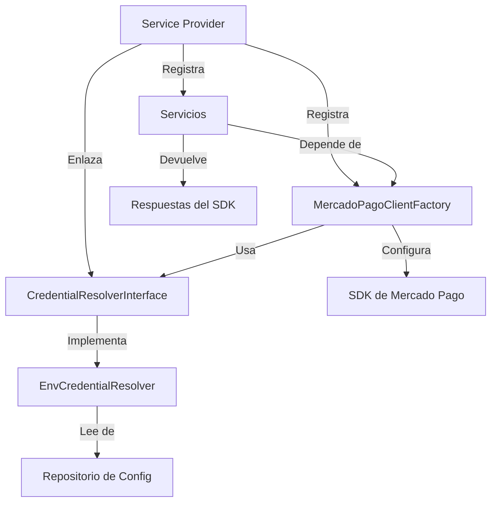

# Arquitectura del Paquete

Laravel MercadoPago está construido con principios de clean architecture, aprovechando el contenedor de servicios de Laravel, la inyección de dependencias y el auto-discovery para proveer una integración con Mercado Pago que es mantenible y fácil de probar.

## Resumen Arquitectónico

El paquete usa una arquitectura en capas que separa responsabilidades y promueve la reutilización de código:

<CardGroup cols={2}>
  <Card title="Capa de Servicios" icon="cube">
    Clases de servicio dedicadas para cada recurso de Mercado Pago
  </Card>
  <Card title="Capa de Soporte" icon="wrench">
    Fábricas y clases de ayuda para manejar el cliente del SDK
  </Card>
  <Card title="Capa de Contratos" icon="file-contract">
    Interfaces para extensibilidad y testing
  </Card>
  <Card title="Capa de DTOs" icon="database">
    Objetos de Transferencia de Datos para un manejo tipado y seguro de credenciales
  </Card>
</CardGroup>

## Componentes Principales

### Service Provider

El `LaravelMercadoPagoServiceProvider` es el punto de entrada para registrar e inicializar el paquete.

**Ubicación**: `src/LaravelMercadoPagoServiceProvider.php`

```php
final class LaravelMercadoPagoServiceProvider extends ServiceProvider
{
    public function register(): void
    {
        // Mezcla la configuración del paquete
        $this->mergeConfigFrom(__DIR__ . '/../config/mercadopago.php', 'mercadopago');

        // Enlaza el resolutor de credenciales
        $this->app->bind(CredentialResolverInterface::class, EnvCredentialResolver::class);

        // Registra los singletons
        $this->app->singleton(MercadoPagoClientFactory::class);
        $this->app->singleton(SdkHttpClient::class);
        $this->app->singleton(PreferenceService::class);
        $this->app->singleton(PaymentService::class);
        // ... otros servicios
    }

    public function boot(Router $router): void
    {
        // Publica la configuración
        $this->publishes([
            __DIR__ . '/../config/mercadopago.php' => config_path('mercadopago.php'),
        ], 'mercadopago-config');

        // Registra el middleware y las rutas
        $router->aliasMiddleware('mercadopago.demo', EnsureDemoRoutesEnabled::class);
        $this->loadRoutesFrom(__DIR__ . '/../routes/api.php');
    }
}
```

### Auto-Discovery

El paquete aprovecha la función de auto-discovery de Laravel. Cuando instalás el paquete vía Composer, Laravel automáticamente:

1. Detecta el service provider en el `composer.json`
2. Registra el service provider durante el arranque de la aplicación
3. Enlaza todos los servicios al contenedor
4. Carga las rutas y middlewares del paquete

<Note>
  No se necesita registrar el provider de manera manual. El paquete está listo para usar
  inmediatamente después de la instalación.
</Note>

### Inyección de Dependencias

Todos los servicios están registrados como singletons en el contenedor de servicios de Laravel, permitiendo una inyección de dependencias muy limpia:

```php
use Fitodac\LaravelMercadoPago\Services\PreferenceService;

class CheckoutController extends Controller
{
    public function __construct(
        private PreferenceService $preferenceService
    ) {}

    public function create()
    {
        $preference = $this->preferenceService->create([
            'items' => [/* ... */]
        ]);
    }
}
```

**Beneficios de registrarlos como singletons:**

- Los servicios se instancian una sola vez por ciclo de petición (request)
- Reduce el consumo de memoria y la sobrecarga de inicialización
- Configuración del SDK compartida a través de todos los servicios
- Resolución consistente de credenciales

## Relación entre Componentes

Así es cómo interactúan los componentes principales:



### Capa de Servicios

Cada servicio encapsula operaciones para un recurso específico de Mercado Pago:

- **PreferenceService** - Preferencias de pago 
- **PaymentService** - Procesamiento de pagos 
- **CustomerService** - Gestión de clientes 
- **CardService** - Tarjetas de clientes 
- **RefundService** - Operaciones de reembolsos 
- **PaymentMethodService** - Medios de pago 
- **WebhookService** - Validación de webhooks 
- **TestUserService** - Creación de usuarios de prueba 

### Capa de Soporte

#### MercadoPagoClientFactory

La fábrica maneja la inicialización y configuración del cliente del SDK.

**Ubicación**: `src/Support/MercadoPagoClientFactory.php`

**Responsabilidades clave:**

1. **Configuración del SDK** - Configura el SDK de Mercado Pago con los tokens de acceso
2. **Resolución del Cliente** - Instancia dinámicamente las clases del cliente del SDK
3. **Compatibilidad de Métodos** - Maneja las diferencias entre versiones del SDK
4. **Entorno de Ejecución** - Establece el entorno adecuado (local/server)

```php
public function makeFirstAvailable(array $clientClasses): object
{
    $this->configureSdk();

    foreach ($clientClasses as $clientClass) {
        if (class_exists($clientClass)) {
            return new $clientClass();
        }
    }

    throw MercadoPagoConfigurationException::clientClassNotFound($clientClasses);
}
```

<Accordion title="¿Por qué usar makeFirstAvailable?">
El SDK de Mercado Pago de vez en cuando cambia los nombres de las clases entre versiones. El método `makeFirstAvailable` le permite al paquete soportar múltiples versiones del SDK intentando instanciar clientes desde un array de posibles nombres de clases.

Esto asegura compatibilidad hacia atrás y hacia adelante sin requerir actualizaciones del paquete por cada cambio del SDK.
</Accordion>

#### SdkHttpClient

Provee acceso HTTP de bajo nivel a la API de Mercado Pago para endpoints que el SDK no cubre o envuelve.

**Usado por**: TestUserService para crear usuarios de prueba con llamadas directas a la API.

### Capa de Contratos

#### CredentialResolverInterface

Define el contrato para la resolución de credenciales, lo cual habilita a que construyas implementaciones personalizadas.

**Ubicación**: `src/Contracts/CredentialResolverInterface.php`

```php
interface CredentialResolverInterface
{
    public function resolve(): MercadoPagoCredentials;
}
```

La implementación por defecto (`EnvCredentialResolver`) lee de la configuración de Laravel, pero vos podés enlazar tu propio resolutor para:

- Obtener credenciales desde una base de datos
- Gestionar configuraciones multi-tenant (multi-empresa)
- Integraciones con Vault o administradores de secretos como AWS Secrets Manager
- Resolución de credenciales por usuario

### Capa de DTOs

#### MercadoPagoCredentials

Un Data Transfer Object de sólo lectura para manejar las credenciales con seguridad de tipos (type-safety).

**Ubicación**: `src/DTO/MercadoPagoCredentials.php`

```php
final readonly class MercadoPagoCredentials
{
    public function __construct(
        public string $accessToken,
        public ?string $publicKey = null,
        public ?string $webhookSecret = null,
    ) {}
}
```

## Manejo de Excepciones

El paquete define excepciones propias para un mejor manejo de errores:

### MercadoPagoConfigurationException

Se lanza cuando:

- El access token no existe
- El SDK no está instalado
- No se encuentra una clase del cliente
- Un método del SDK no se encuentra

### InvalidWebhookSignatureException

Se lanza cuando:

- El header de firma de un webhook está mal formado
- La validación HMAC de firma ha fallado

## Principios de Diseño

### 1. Responsabilidad Única
Cada clase de servicio maneja exactamente un tipo de recurso de Mercado Pago.

### 2. Inversión de Dependencia
Los servicios dependen de abstracciones (`CredentialResolverInterface`) en lugar de implementaciones concretas.

### 3. Principio Abierto/Cerrado
El paquete está abierto a extensiones (como implementar resolutores propios) pero cerrado a modificaciones (los servicios base no deben cambiarse).

### 4. Segregación de Interfaces
La interface de resolución tiene un solo método, para que tus implementaciones no carguen con lógica muerta.

## Extender el Paquete

### Resolutor de Credenciales Personalizado

```php
namespace App\Services;

use Fitodac\LaravelMercadoPago\Contracts\CredentialResolverInterface;
use Fitodac\LaravelMercadoPago\DTO\MercadoPagoCredentials;

class DatabaseCredentialResolver implements CredentialResolverInterface
{
    public function resolve(): MercadoPagoCredentials
    {
        $credentials = \DB::table('payment_credentials')
            ->where('provider', 'mercadopago')
            ->first();

        return new MercadoPagoCredentials(
            accessToken: $credentials->access_token,
            publicKey: $credentials->public_key,
            webhookSecret: $credentials->webhook_secret,
        );
    }
}
```

Enlazalo en `AppServiceProvider`:

```php
public function register()
{
    $this->app->bind(
        CredentialResolverInterface::class,
        DatabaseCredentialResolver::class
    );
}
```

## Próximos Pasos

<CardGroup cols={2}>
  <Card title="Servicios" icon="cube" href="/es/concepts/services">
    Explorá todos los servicios disponibles y sus métodos
  </Card>
  <Card title="Credenciales" icon="key" href="/es/concepts/credentials">
    Aprendé sobre gestión de credenciales y seguridad
  </Card>
</CardGroup>
